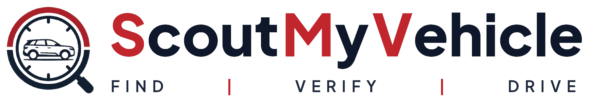

<p align="center">
  
</p>

# ScoutMyVehicle 🚗
### Real-Time Multi-Brand Showroom Stock & Allocation Tracker
**FIND | VERIFY | DRIVE**

**ScoutMyVehicle** connects car buyers with authorized dealership networks across **9 major automotive brands**. It eliminates long dealership waiting periods by surfacing real-time showroom ready stock, in-transit units, and verified allocations—empowering buyers to secure the vehicle they want without paying extra dealer markups or premiums.

---

## 🏢 Authorized Brand Network

ScoutMyVehicle covers **87+ models** and **670+ active variants** across 18 authorized dealership nodes representing leading OEMs:

| Brand | Emblem / Network | Popular Showroom Models |
| :--- | :--- | :--- |
| **Maruti Suzuki Arena** | Arena Network | Swift, Brezza, Dzire, Ertiga, WagonR, Alto K10 |
| **Maruti Suzuki Nexa** | Nexa Network | Grand Vitara, Fronx, Baleno, Jimny, XL6, Invicto |
| **Tata Motors** | Tata Motors Passenger Vehicles | Nexon, Punch, Harrier, Safari, Curvv, Altroz, Tiago |
| **Mahindra** | Mahindra & Mahindra | Thar Roxx, Scorpio-N, XUV700, XUV 3XO, Thar, Scorpio Classic |
| **Hyundai** | Hyundai Motor India | Creta, Venue, Exter, i20, Alcazar, Verna, Tucson |
| **Kia** | Kia India | Seltos, Sonet, Carens, Carnival, EV6 |
| **Toyota** | Toyota Kirloskar Motor | Innova Hycross, Urban Cruiser Hyryder, Fortuner, Glanza, Hilux |
| **Volkswagen** | Volkswagen India | Virtus, Taigun, Tiguan |
| **Škoda** | Škoda Auto India | Slavia, Kushaq, Kodiaq, Kylaq |
| **Nissan** | Nissan Motor India | Magnite, X-Trail |

---

## 🚀 Key Features

1. **Model-Centric Catalog with In-Card Configuration Selectors**:
   - Streamlined browsing by distinct car models (reducing catalog clutter from hundreds of duplicate variant cards).
   - Interactive selectors directly inside each model card for **Car Variant**, **Fuel Type**, **Transmission**, and **Exterior Colour**.
   - Dynamic real-time updates of vehicle specifications, ex-showroom pricing, and stock status right inside the card.
   - Clean top-level filter controls for **Brand** and **Model** with dedicated **Submit** and **Clear all** buttons.

2. **Authorized Bank & Auto Finance Partners**:
   - Header integration featuring premier institutional automotive lending partners:
     - **State Bank of India (SBI)**: Low public-sector interest rates, YONO instant approval, zero foreclosure penalty.
     - **Punjab National Bank (PNB)**: Concessions for women applicants, EV/CNG discounts, flexible margins.
     - **HDFC Bank**: Leading private lender with 30-minute fast-track approvals, 100% on-road funding, step-up EMIs.
     - **Chola Mandalam (Murugappa Group)**: Premier vehicle NBFC with minimal income proof requirements and flexible seasonal repayment for self-employed/rural buyers.
   - **Interactive Live Car Loan EMI Calculator**: Real-time slider-based monthly EMI estimates, total interest, and total payable calculations.
   - Preferred bank partner selection seamlessly attached to customer inquiries.

3. **Dynamic Live Feeds**:
   - **Randomized Discovery**: Vehicle cards are randomized upon every page refresh to ensure fair, diverse vehicle visibility across all manufacturers.
   - **Live Stock Indicator**: Cards display dynamic morning live verification timestamps (*e.g., "Stock live at 10:45 AM"*).

4. **Privacy-First Customer Experience**:
   - **No Hidden Markups**: *"Don't pay extra/premium for the car you are looking for."*
   - **Confidential Dealer Relations**: Specific dealership branch names and internal locations are kept confidential on customer-facing cards to protect showroom partner networks while verifying authentic live inventory.
   - **Flexible Location Input**: Customers can specify any delivery location without rigid dropdowns or RTO restrictions.

5. **1-Click Dealership Connect & Lead Management**:
   - **Inquiry & Availability Check**: Submit inquiries capturing exact vehicle model, selected variant, fuel, transmission, color, and financing preferences.
   - **Showroom Staff & Dealer Management Portal (`/dealer` & `/admin/login`)**: Real-time leads dashboard tracking customer timelines, finance requirements, preferred bank partners, and exchange details.

---

## 💻 Tech Stack

- **Backend**: Python 3.12, FastAPI, SQLite (`scoutmycar.db`), Pydantic models.
- **Frontend**: Tailwind CSS, Alpine.js, Lucide Icons, clean vector brand emblems.
- **Testing**: Python `unittest` test suite with automated database seeding and teardown isolation.

---

## 🛠️ Quick Start

### 1. Activate Virtual Environment
```powershell
.\.venv\Scripts\Activate.ps1
```

### 2. Seed the Database
Seed all 18 dealerships, 87 car models, and 671 variants:
```powershell
python -m app.seed_data
```

### 3. Run the Application
```powershell
python run.py
```

### 4. Run the Test Suite
```powershell
python -m unittest tests/test_app.py
```

---

## 🌐 Application Endpoints

- **Customer Portal**: [http://127.0.0.1:8000/](http://127.0.0.1:8000/)
- **Showroom Staff & Admin Login**: [http://127.0.0.1:8000/admin/login](http://127.0.0.1:8000/admin/login)
- **Dealer Management Portal**: [http://127.0.0.1:8000/dealer](http://127.0.0.1:8000/dealer)
- **Interactive API Documentation (Swagger)**: [http://127.0.0.1:8000/docs](http://127.0.0.1:8000/docs)
